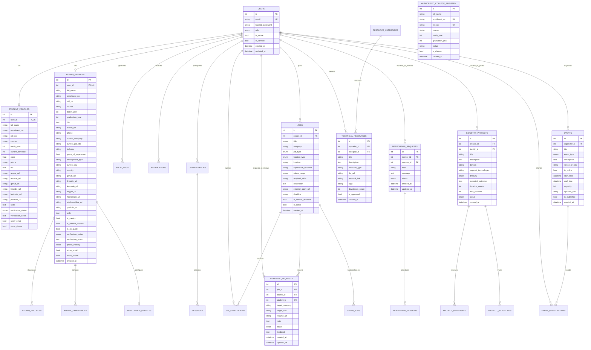

# CMS Kanpur Alumni Platform - Database Schema & ER Diagram

## 1. Entity Relationship (ER) Diagram

---

## 2. Table Specifications & Indexes

### 2.1 `users`
- **Primary Key**: `id` (Auto-increment integer)
- **Indexes**:
  - `idx_users_email` (UNIQUE): Fast login lookup
  - `idx_users_role`: Fast RBAC filtering
  - `idx_users_verified`: Quick status filtering

### 2.2 `authorized_college_registry`
- **Primary Key**: `id`
- **Indexes**:
  - `idx_registry_enrollment` (UNIQUE): Prevents duplicate college registrations
  - `idx_registry_roll` (UNIQUE): Rapid enrollment verification

### 2.3 `alumni_profiles`
- **Primary Key**: `id`
- **Foreign Key**: `user_id` -> `users.id` (ON DELETE CASCADE)
- **Indexes**:
  - `idx_alumni_course_batch`: Accelerated multi-year batch filtering (e.g. `MCA 2020-2024`)
  - `idx_alumni_company`: Quick company cluster aggregations
  - `idx_alumni_mentor`: Instant filter for available mentors
  - `idx_alumni_referral`: Instant filter for referral providers

### 2.4 `jobs`
- **Primary Key**: `id`
- **Foreign Key**: `poster_id` -> `users.id`
- **Indexes**:
  - `idx_jobs_active_type`: Quick filtering of active full-time jobs vs internships
  - `idx_jobs_company`: Rapid search by hiring entity

### 2.5 `referral_requests`
- **Primary Key**: `id`
- **Foreign Keys**:
  - `alumni_id` -> `users.id`
  - `student_id` -> `users.id`
  - `job_id` -> `jobs.id`
- **Status State Machine**:
  `REQUESTED` -> `UNDER_REVIEW` -> `ACCEPTED` / `REJECTED` -> `REFERRED` -> `INTERVIEW` -> `SELECTED` -> `CLOSED`
